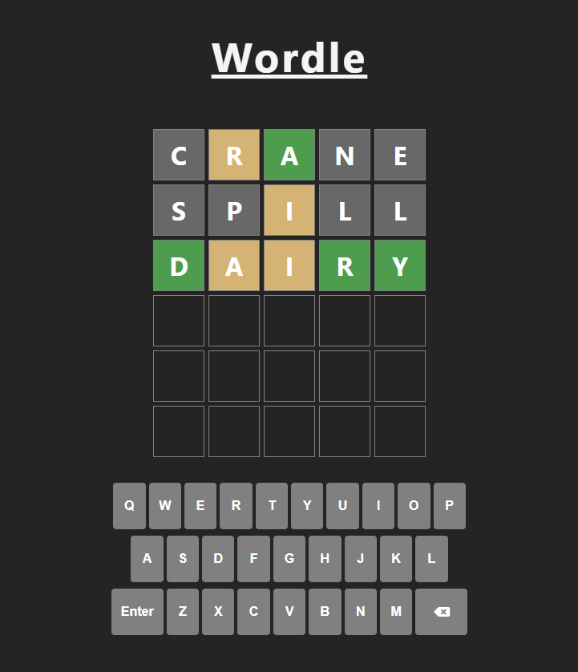

# Wordle Clone

# Wordle Clone

A browser-based clone of the popular word game Wordle, built with React and Vite.



## Live Demo

[Play here](https://your-deployed-url.com)

## How to Play

- Guess the hidden 5-letter word in 6 attempts
- After each guess, tiles change color to show how close you were:
  - **Green** — correct letter, correct position
  - **Yellow** — correct letter, wrong position
  - **Gray** — letter not in the word
- Submitted words are validated against a txt file of 5700 words. Many valid 5 letter words are missing.

## Features

- Physical keyboard and on-screen keyboard support
- Word validation against a full 5-letter word list
- Tile flip animation on guess submission
- Tile pop animation when typing
- Row shake animation on invalid word
- Win/lose modal with play again option

## Tech Stack

- React
- Vite
- CSS

## Run Locally

```bash
npm install
npm run dev
```
